# ForkWork — карта приложения и бизнес-процессы

Диаграммы в нотации **Mermaid** (рендерятся прямо на GitHub) и **BPMN-приближении**.
Источник истины — код в `src/` (роуты `app/api/*`, схема `lib/db.ts`, статусы `lib/types.ts`).

**Условные обозначения для процессов (BPMN-приближение):**

| Фигура | Mermaid | Значение |
|---|---|---|
| `([...])` | стадион | событие (старт / конец) |
| `[...]` | прямоугольник | задача / действие |
| `{...}` | ромб | шлюз-развилка (XOR) |
| `subgraph` | рамка | дорожка (lane) — роль/система |

---

## 1. Карта приложения (роли и разделы)

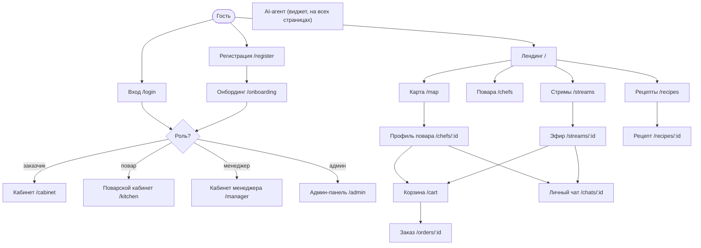

### Разделы кабинетов (вкладки)

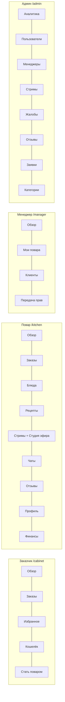

---

## 2. Слои приложения (страница → API → данные)

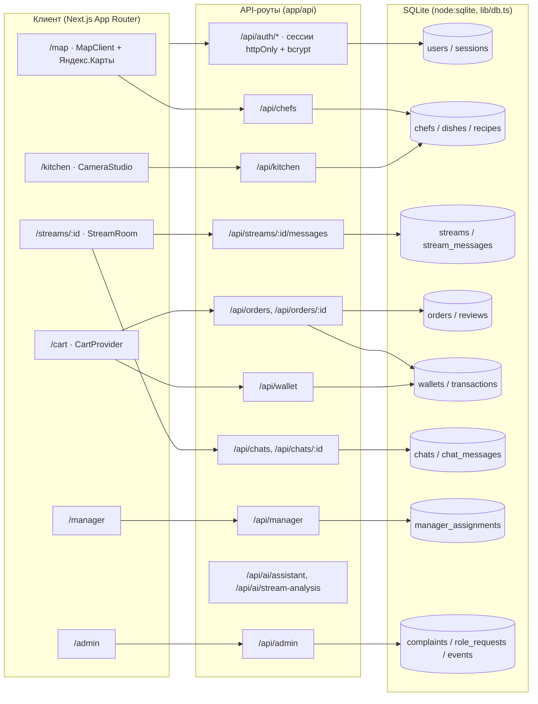

---

## 3. Модель данных (ER)

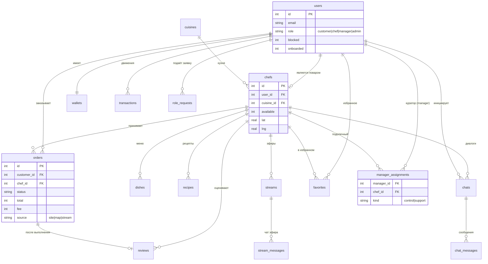

---

## 4. Бизнес-процесс: заказ блюда (E2E)

Дорожки: **Заказчик**, **Платформа (API)**, **Повар**. Источник: `api/orders` и `api/orders/:id`.

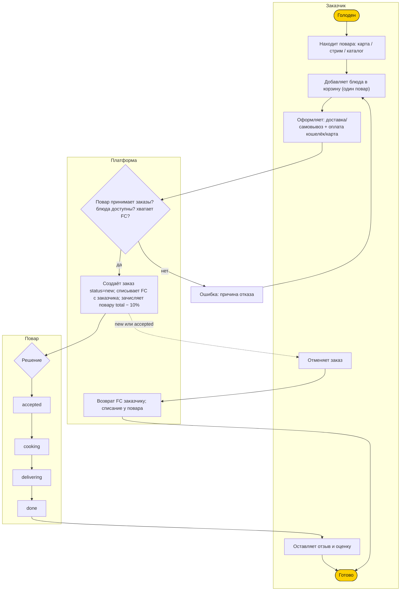

### Машина состояний заказа

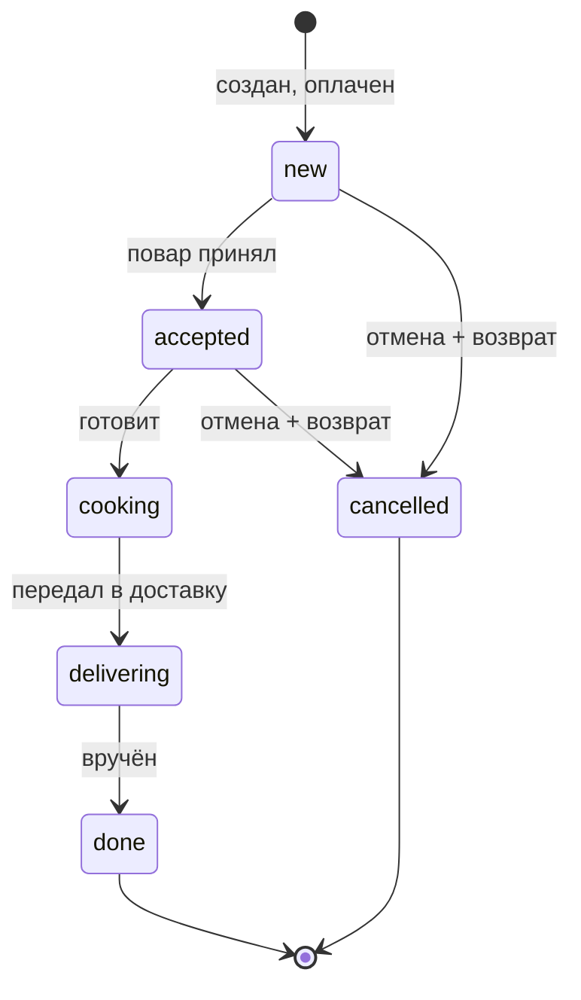

---

## 5. Платёж и кошелёк (оплата заказа)

Демо-упрощение: повар получает деньги сразу, за вычетом комиссии 10%. Источник: `api/orders` (POST).

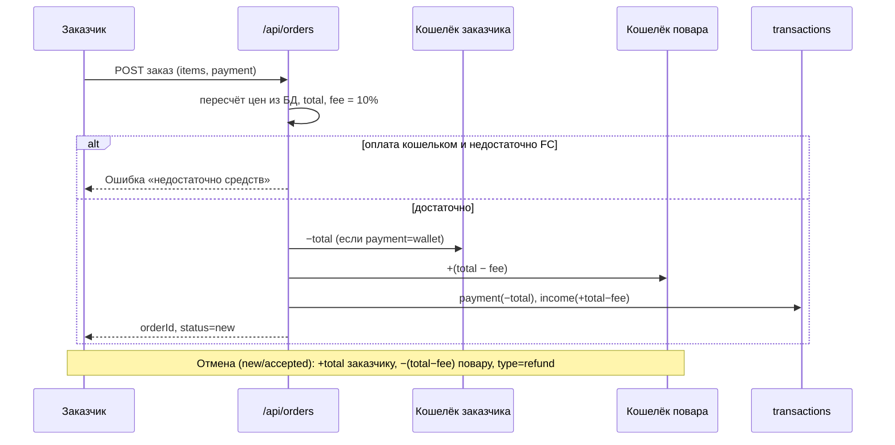

---

## 6. Стриминг и заказ из эфира

Источник: `api/kitchen` (stream_create/start/stop), `api/streams/:id/messages` (симуляция зрителей), `api/ai/stream-analysis`.

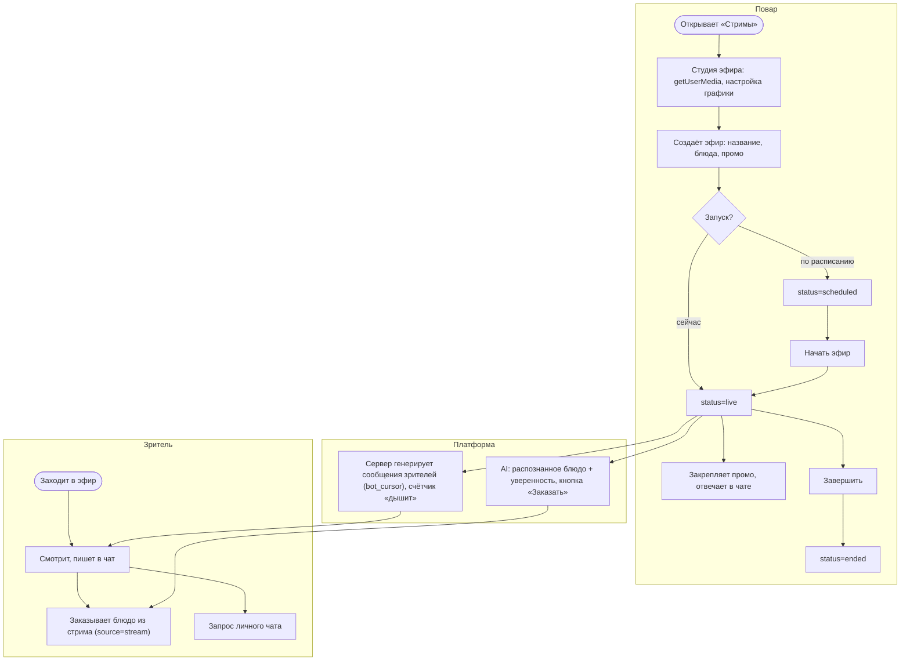

---

## 7. Личный чат по согласию повара

Источник: `api/chats/:id` (PATCH accept/decline/block). Статусы: `pending → active | declined | blocked`.

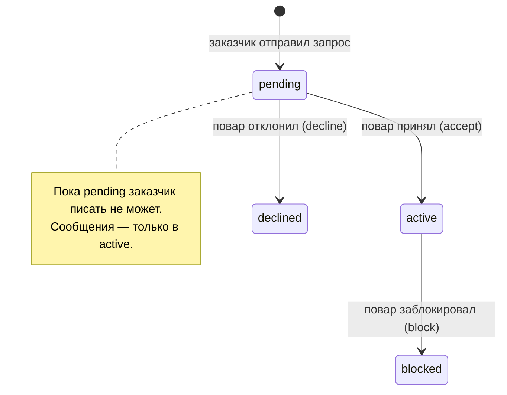

---

## 8. Заявка «стать поваром» и модерация

Источник: `api/role-requests` (создание), `api/admin` (request_approve / request_reject).

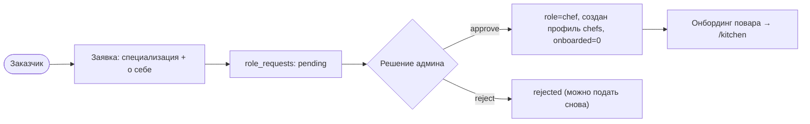

---

## 9. Менеджер: кураторство и передача прав

Источник: `api/admin` (manager_assign), `api/manager` (transfer + быстрые инструменты). Права: `control` и `support`.

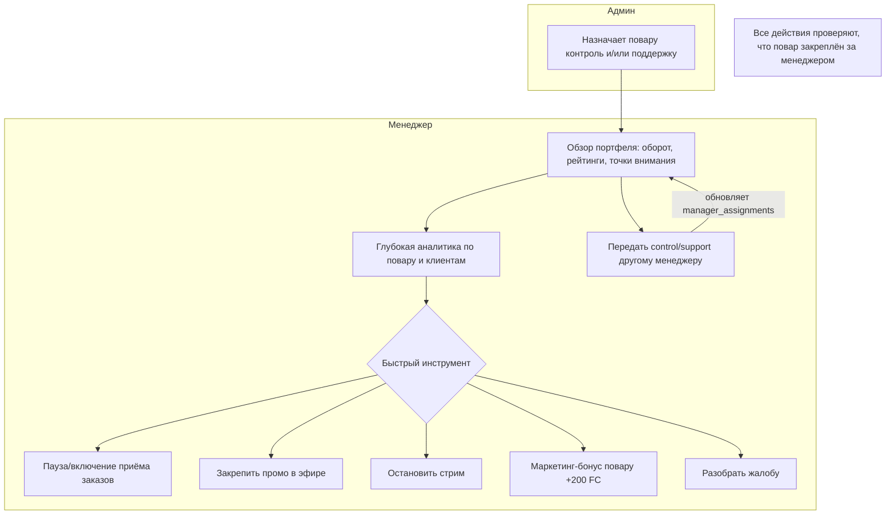

---

## 10. Сводный поток ценности

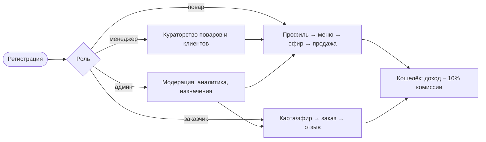
